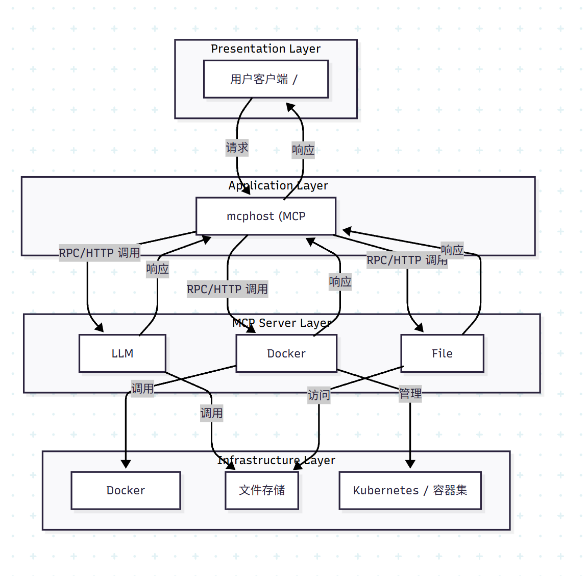
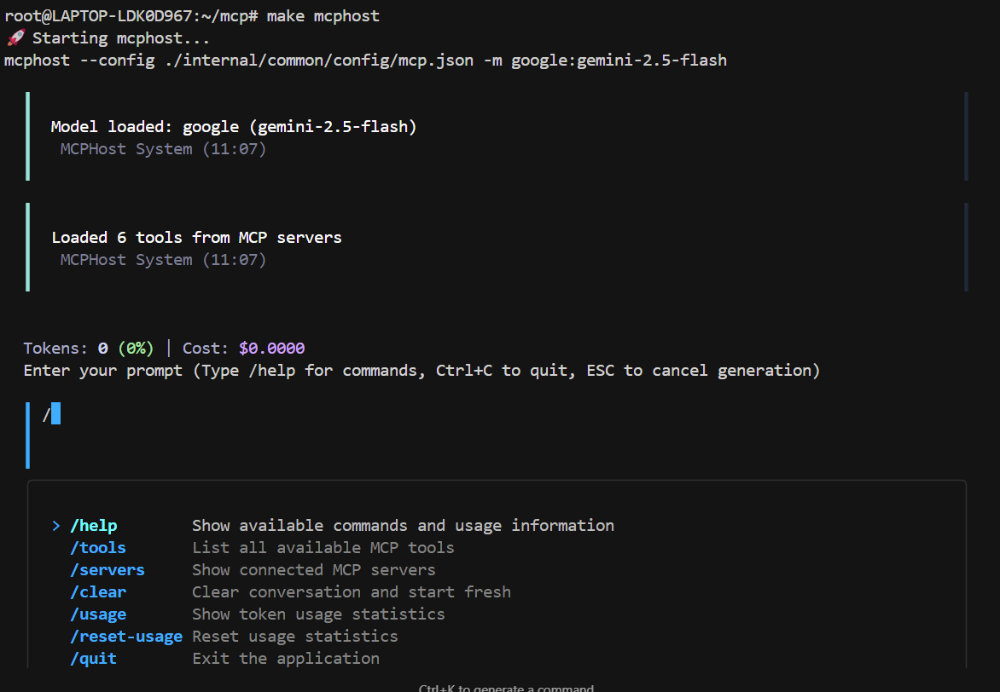

# 🚀 GoMcp - Intelligent LLM Tool Service Platform

[](https://golang.org)
[](LICENSE)
[](docker-compose.yaml)

> A multi-agent system based on MCP (Model Context Protocol) architecture, supporting registration and invocation of multiple AI tools with high scalability and observability.



## 📋 Table of Contents

- [Project Overview](#project-overview)
- [Core Features](#core-features)
- [Technical Architecture](#technical-architecture)
- [Quick Start](#quick-start)
- [Feature Modules](#feature-modules)
- [API Documentation](#api-documentation)
- [Deployment Guide](#deployment-guide)
- [Development Guide](#development-guide)
- [Contributing](#contributing)

## 🎯 Project Overview

GoMcp is an intelligent LLM tool service platform built on the MCP protocol, designed to provide unified multi-agent tool management and invocation services. The project is developed in Go and supports integration of various AI tools including LLM Q&A, document parsing, code review, vector search, and more.

### Key Advantages

- 🔌 **Plugin Architecture**: Supports dynamic tool registration and extension
- 🚀 **High Performance**: Built with Go, response time ≤ 1s
- 🔍 **Observability**: Integrated OpenTelemetry for distributed tracing
- 🐳 **Containerized Deployment**: Supports Docker and Kubernetes deployment
- 📊 **Vector Database**: Integrated TiDB for document embedding and similarity search

## ✨ Core Features

### 🤖 AI Tool Services
- **LLM Q&A**: Support for Gemini, OpenAI, and other models
- **Code Review**: Automatic code quality analysis and suggestions
- **Document Summarization**: Intelligent document content summarization
- **RAG Enhancement**: Retrieval-Augmented Generation based on documents

### 🏭 Tool Management
- **Factory Pattern**: Unified tool registration and management mechanism
- **Auto Discovery**: Automatic tool registration and loading
- **Configuration Management**: Flexible configuration system based on Viper

### 🗄️ Data Storage
- **Vector Database**: TiDB integration for document embedding
- **Similarity Search**: Efficient vector similarity computation
- **Resource Management**: Support for multiple document format parsing

### 🔧 DevOps
- **Distributed Tracing**: OpenTelemetry integration
- **Containerization**: Docker support
- **CI/CD**: Jenkins + ArgoCD + Kubernetes
- **Monitoring & Alerting**: Complete observability solution

## 🏗️ Technical Architecture

### Core Components

- **MCP Server**: Protocol communication layer, handling client requests
- **Tool Factory**: Tool registration factory, managing all available tools
- **LLM Service**: Large language model service, supporting multiple AI models
- **File Service**: File processing service, supporting document parsing
- **Vector Service**: Vector database service, supporting similarity search
- **Config Service**: Configuration management service, based on Viper

## 🚀 Quick Start

### Prerequisites

- Go 1.24.4+
- Docker & Docker Compose
- MySQL/TiDB (optional, for vector database)

### Installing Go Environment

#### Method 1: Official Installer (Recommended)

1. **Download Go 1.24.4+**
   - Visit [Go Official Download Page](https://golang.org/dl/)
   - Choose the version suitable for your system:
     - **Linux**: `go1.24.4.linux-amd64.tar.gz`
     - **macOS**: `go1.24.4.darwin-amd64.tar.gz`
     - **Windows**: `go1.24.4.windows-amd64.msi`

2. **Linux/macOS Installation**
```bash
# Download and extract
wget https://go.dev/dl/go1.24.4.linux-amd64.tar.gz
sudo tar -C /usr/local -xzf go1.24.4.linux-amd64.tar.gz

# Configure environment variables
echo 'export PATH=$PATH:/usr/local/go/bin' >> ~/.bashrc
source ~/.bashrc

# Verify installation
go version
```

3. **Windows Installation**
   - Download the `.msi` installer
   - Double-click to run the installer
   - Follow the wizard to complete installation
   - Open Command Prompt to verify: `go version`

#### Method 2: Package Manager Installation

**Ubuntu/Debian:**
```bash
sudo apt update
sudo apt install golang-go
```

**CentOS/RHEL:**
```bash
sudo yum install golang
# Or use dnf (newer versions)
sudo dnf install golang
```

**macOS (using Homebrew):**
```bash
brew install go
```

#### Method 3: Using g (Go Version Manager)

```bash
# Install g
curl -sSL https://git.io/g-install | sh -s

# Install specific Go version
g install 1.24.4

# Use specific version
g use 1.24.4
```

#### Verify Installation

```bash
# Check Go version
go version

# Check Go environment
go env

# Set GOPROXY (recommended for Chinese users)
go env -w GOPROXY=https://goproxy.cn,direct
```

### Installation Steps

1. **Clone the Repository**
```bash
git clone https://github.com/leebrouse/GoMcp.git
cd GoMcp
```

2. **Install Dependencies**
```bash
# install dependence
go mod download

# install mcphost
go install github.com/mark3labs/mcphost@latest

# add your Gemini api key
export GOOGLE_API_KEY='your-api-key'
```

3. **Configure Environment**
```bash
cp internal/common/config/mcp.json.example internal/common/config/mcp.json
# Edit configuration file, set API keys, etc.
```

4. **Start Service**
```bash
# Using Makefile
make mcphost

# Or run directly
mcphost --config ./internal/common/config/mcp.json -m google:gemini-2.5-flash
```



### Docker Deployment (Not complete yet)

```bash
# Build image
make docker-build

# Start service
docker-compose up -d
```

## 📦 Feature Modules

### 1. LLM Tool Services (`internal/llm/`)

Provides various AI tool services:

- **ChatBox**: General conversation service
- **CodeReview**: Code review service
- **Summarize**: Document summarization service

### 2. File Processing Services (`internal/file/`)

Supports multiple file format processing:

- **PDF Parsing**: Document content extraction
- **Text Processing**: Text cleaning and preprocessing
- **Format Conversion**: Support for multiple format conversions

### 3. Common Components (`internal/common/`)

- **Configuration Management**: Configuration system based on Viper
- **Data Models**: Unified data structure definitions
- **Design Patterns**: Implementation of common design patterns
- **OpenTelemetry**: Observability integration

### 4. Tool Factory (`internal/llm/factory/`)

Implements dynamic tool registration and management:

```go
// Tool registration example
func init() {
    factory.RegisterTool("chatbox", &ChatBoxTool{})
    factory.RegisterTool("codeReview", &CodeReviewTool{})
}
```

## 📚 API Documentation

### MCP Protocol Interfaces

The project provides the following interfaces based on MCP protocol:

#### 1. Tool List (`listTools`)

Get list of all available tools:

```json
{
  "tools": [
    {
      "name": "chatbox",
      "description": "General conversation service",
      "inputSchema": {
        "type": "object",
        "properties": {
          "prompt": {
            "type": "string",
            "description": "User input question"
          }
        }
      }
    }
  ]
}
```

#### 2. Tool Invocation (`callTool`)

Invoke specified tool:

```json
{
  "name": "chatbox",
  "arguments": {
    "prompt": "Hello, please introduce the GoMcp project"
  }
}
```

#### 3. Resource Management (`listResources`)

Manage document resources:

```json
{
  "resources": [
    {
      "uri": "file:///path/to/document.pdf",
      "name": "Project Documentation",
      "description": "GoMcp project documentation"
    }
  ]
}
```

### Configuration Example

```yaml
mcpServer:
  llm:
    serverName: "llm-server"
    serverVersion: "v1.0.0"
    models:
      - name: "gemini-2.5-flash"
        provider: "google"
        apiKey: "${GEMINI_API_KEY}"
      - name: "gpt-4"
        provider: "openai"
        apiKey: "${OPENAI_API_KEY}"
  
  vector:
    database:
      type: "tidb"
      host: "localhost"
      port: 4000
      database: "vector_db"
```

## 🐳 Deployment Guide (Not complete yet)

### Kubernetes Deployment

1. **Create Namespace**
```bash
kubectl create namespace mcp-system
```

2. **Deploy Application**
```bash
kubectl apply -f k8s/deployment.yaml
kubectl apply -f k8s/service.yaml
```

3. **Configure ConfigMap**
```bash
kubectl apply -f k8s/configmap.yaml
```

### CI/CD Pipeline

The project supports complete CI/CD pipeline:

1. **Code Commit** → GitHub/GitLab
2. **Automated Testing** → Jenkins
3. **Build Image** → Docker
4. **Push Image** → Docker Registry
5. **Auto Deploy** → ArgoCD + Kubernetes

## 🛠️ Development Guide

### Project Structure

```
GoMcp/
├── cmd/                    # Main program entry
├── internal/              # Internal packages
│   ├── common/           # Common components
│   │   ├── config/       # Configuration management
│   │   ├── model/        # Data models
│   │   └── opentelemetry/ # Observability
│   ├── llm/              # LLM services
│   │   ├── domain/       # Domain models
│   │   ├── service/      # Business services
│   │   ├── handler/      # Request handlers
│   │   └── factory/      # Tool factory
│   └── file/             # File services
├── example/              # Example code
├── test/                 # Test cases
├── Requirement/          # Requirement documents
└── images/              # Documentation images
```

### Adding New Tools

1. **Implement Tool Interface**
```go
type Tool interface {
    Name() string
    Description() string
    Execute(ctx context.Context, args map[string]interface{}) (interface{}, error)
}
```

2. **Register Tool**
```go
func init() {
    factory.RegisterTool("myTool", &MyTool{})
}
```

3. **Write Tests**
```go
func TestMyTool(t *testing.T) {
    // Test code
}
```

### Running Tests

```bash
# Run all tests
make test

# Run MCP integration tests
make test-mcp

# Run specific tests
go test -v ./test/llm_function_test/
```

## 🤝 Contributing

We welcome all forms of contributions!

### Contribution Process

1. Fork the project
2. Create a feature branch (`git checkout -b feature/AmazingFeature`)
3. Commit your changes (`git commit -m 'Add some AmazingFeature'`)
4. Push to the branch (`git push origin feature/AmazingFeature`)
5. Open a Pull Request

### Development Standards

- Follow Go language coding standards
- Add necessary test cases
- Update relevant documentation
- Ensure CI/CD pipeline passes

## 📄 License

This project is licensed under the MIT License - see the [LICENSE](LICENSE) file for details.

## 🙏 Acknowledgments

- [MCP Protocol](https://modelcontextprotocol.io/) - Model Context Protocol
- [Mark3Labs](https://github.com/mark3labs/mcp-go) - Go MCP implementation
- [LangChain Go](https://github.com/robermar23/langchaingo) - Go AI framework
- [Viper](https://github.com/spf13/viper) - Configuration management library
- [GORM](https://gorm.io/) - Go ORM library

## 📞 Contact Us

- **Author**: Leebrouse
- **Project URL**: https://github.com/leebrouse/GoMcp
- **Issue Feedback**: [GitHub Issues](https://github.com/leebrouse/GoMcp/issues)

---

⭐ If this project helps you, please give us a star!
